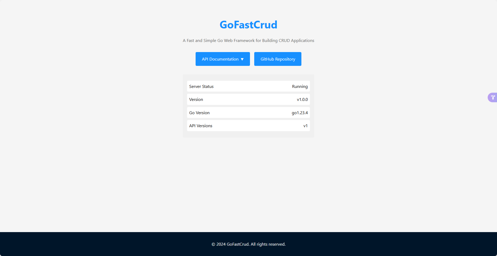
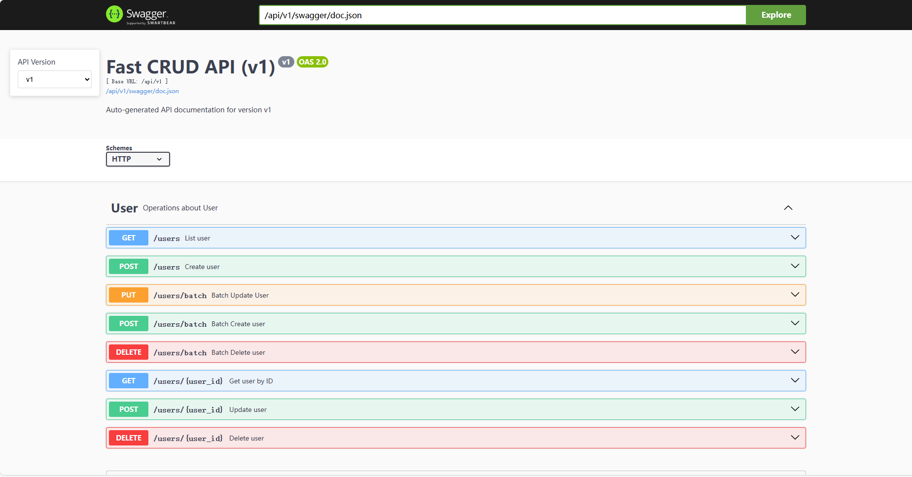

# GoFastCrud

GoFastCrud 是一个基于 Gin 框架的快速 CRUD 开发框架，帮助开发者快速构建 RESTful API。

## 特性

- 🚀 快速生成标准 CRUD 接口
- 📚 自动生成 Swagger 文档
- 🛠 支持自定义控制器和路由
- 🔌 灵活的中间件支持
- 🎯 类型安全的泛型实现
- 📦 工厂模式简化注册流程
- 💡 支持自定义响应处理
- 🔒 内置权限验证机制
- 📊 支持多种数据库（待开发）
- 🔍 丰富的查询条件支持
- 📝 完整的日志记录
- ⚡️ 高性能设计（待开发）
- 🔄 支持事务处理
- 🛡 内置安全防护（待开发）

## 安装

```bash
go get github.com/kruily/gofastcrud
```

## 使用

### 1. 配置

```go
// config.yaml
server: 
  address: ":8080"  // 服务地址

database:
  driver: "mysql" // 数据库驱动
  host: "localhost" // 数据库地址
  port: 3306 // 数据库端口
  username: "root" // 数据库用户名
  password: "password" // 数据库密码
  database: "test_crud" // 数据库名称
```
### 2. 启动服务
```go
// main.go

type User struct {
    ...
}

func main() {    
    // 创建应用实例
    app := app.NewDefaultGoFastCrudApp()

    // 发布API版本
    app.PublishVersion(server.V1)

    // 注册控制器
    app.RegisterControllers(func(factory *crud.ControllerFactory, server *server.Server) {
       factory.Register(server, User{})
    })

    // 启动服务
    app.Start()
}
```
启动服务，访问主页：`http://localhost:8080`


现在用户各个接口均已自动注册到GIN ROUTER中,可以点击主页API Documentation查看Swagger文档或访问：`http://localhost:8080/api/v1/swagger/index.html`


### 3. 定义实体模型
需要继承 `crud.BaseEntity` 并实现 `crud.ICrudEntity` 接口的 `Table` 方法
```go
// models/user.go
type User struct {
    // 嵌入crud基础实体 
    *crud.BaseEntity  `json:"-"` //不参与json序列化
	Username  string `json:"username" binding:"required" description:"用户名"`
	Email     string `json:"email" description:"邮箱地址"`
}

// 定义表名 必须实现
func (u *User) TableName() string {
	return "users"
}
// 初始化 必须实现
func (u *User)Init(){
    if u.BaseUUIDEntity == nil {
		u.BaseUUIDEntity = &crud.BaseUUIDEntity{}
	}
}
```

### 4. 控制器
有两种方式创建控制器：

#### 4.1 使用默认控制器
只需传入实体模型
```go
factory.Register(server, models.User{})
```

#### 4.2 使用自定义控制器
需要继承 `crud.CrudController` 并定义出创建控制器实例的方法
```go
// controllers/user_controller.go
type UserController struct {
    // ***嵌入 CrudController***
    *crud.CrudController[models.User] 
}
// 创建控制器实例
func NewUserController(db *gorm.DB) *UserController {
    controller := &UserController{
        CrudController: crud.NewCrudController(db, models.User{}),
    }
    // 应用中间件（可选）
    controller.UseMiddleware("*", middleware.Auth())
    // 某类方法应用中间件（可选）
    controller.UseMiddleware("POST", middleware.Validate())

    // 添加自定义路由
    controller.AddRoute(types.APIRoute{
        Path:        "/login",
        Method:      "POST",
        // swagger 信息
        Tags:        []string{controller.GetEntityName()},
        Summary:     "用户登录",
        Description: "通过用户名和密码进行登录",
        // 请求处理函数
        Handler:     controller.Login,
        // 只对当前路由应用中间件（可选）
        Middleware:  []gin.HandlerFunc{middleware.Auth()},
    })

    // 或者
    controller.AddRoutes([]*types.APIRoute{
        // 链式写法
        types.Post("/register", controller.Registor).  // Post、Get、Put、Delete 等方法
			WithSummary("注册用户"). // swagger 标题 信息
			WithDescription("注册用户"). // swagger 简介 信息
			WithTags([]string{controller.GetEntityName()}). // swagger tags 信息
			WithRequest(&UserRegister{}).  // 请求参数类型
			WithResponse(&Userinfo{}).  // 返回参数类型
			WithMiddlewares(),  // 中间件 信息
        ...
    })

    return controller
}

// 自定义方法 返回值必须为(interface{}, error) 
//interface{} 为返回数据 error 为错误信息
// 无需关注Response 框架会自动处理
func (c *UserController) Login(ctx *gin.Context)(interface{}, error) {
    ...
}

```

```go
factory.RegisterCustom(server, controllers.NewUserController)
```

### 5. 完整示例
[example](./example)


### 标准 CRUD 接口

- `GET /{entity}` - 获取列表
- `POST /{entity}` - 创建实体
- `GET /{entity}/:id` - 获取单个实体
- `POST /{entity}/{id}` - 更新实体
- `DELETE /{entity}/{id}` - 删除实体
- `POST /{entity}/batch` - 批量创建
- `POST /{entity}/batch` - 批量更新
- `DELETE /{entity}/batch` - 批量删除

## 高级特性

### 中间件支持

```go
// 控制器全局中间件，* 表示所有方法，POST 表示指定方法
controller.UseMiddleware("*", middleware.Auth())

// 方法特定中间件
controller.UseMiddleware("POST", middleware.Validate())

// 自定义方法应用中间件
controller.AddRoute(types.APIRoute{
    Path:        "/login",
    Method:      "POST",
    ...
    Middleware:  []gin.HandlerFunc{middleware.Check()},
})
```

### 自定义响应处理
```go
app := app.NewDefaultGoFastCrudApp(WithResponse(CustomResponser{}))
```
`CustomResponser` 需要实现 `ICrudResponse` 接口
```go
// internal/crud/response.go
type ICrudResponse interface {
	Success(data interface{}) interface{}
	Error(err error) interface{}
	Pagenation(items interface{}, total int64, page int, size int) interface{}
}
```
然后在NewDefaultGoFastCrudApp中传入即可 ```NewDefaultGoFastCrudApp(WithResponse(CustomResponser{}))```

### DI 支持
```go
# 获取DI
di.SINGLE()

# 注册依赖 单例
di.BindSingletonWithName("SERVICE", &Service{})
di.BindSingletonWithType(&Service{})

# 获取依赖 单例
di.GetSingletonByName("SERVICE")
di.GetSingletonByType(&Service{})
```

### 获取Repository 单独使用
```go
// 获取Repository
repo := di.GetSingletonByName(models.User{}.Table())
```
Repository 实现 [`ICrudRepository`](./core/crud/repository.go) 接口

### filter查询 快速支持
在model中定义filter tag,以逗号分隔各操作符
支持的操作符（**只允小写**）：
- `gt` 大于
- `gte` 大于等于
- `lt` 小于
- `lte` 小于等于
- `eq` 等于
- `neq` 不等于
- `in` 在...中
- `nin` 不在...中
- `like` 模糊查询(像)
- `nlike` 不模糊查询(不像)
- `between` 范围查询
- `null` 为空
- `all` 包含所有

示例：
```go
type User struct {
	*crud.BaseUUIDEntity
	Username string `gorm:"type:varchar(20);not null;unique" json:"username" filter:"eq,neq,like,nlike,in,nin"`
	Password string `gorm:"type:varchar(20);not null" json:"-"`
	Email    string `gorm:"type:varchar(20);not null;unique" json:"email" filter:"eq,neq,like,nlike,in,nin"`
}

func (*User) TableName() string {
	return "users"
}

func (u *User) Init() {
	if u.BaseUUIDEntity == nil {
		u.BaseUUIDEntity = &crud.BaseUUIDEntity{}
	}
}
```

## 贡献指南

1. Fork 本仓库
2. 创建特性分支 (`git checkout -b feature/AmazingFeature`)
3. 提交更改 (`git commit -m 'Add some AmazingFeature'`)
4. 推送到分支 (`git push origin feature/AmazingFeature`)
5. 提交 Pull Request

## 许可证

本项目采用 MIT 许可证 - 查看 [LICENSE](LICENSE) 文件了解详情